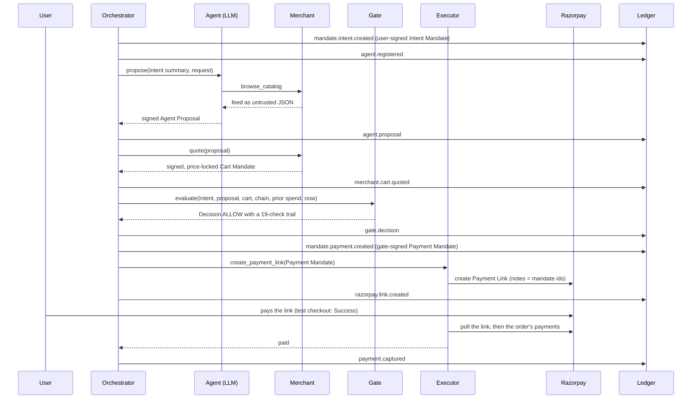
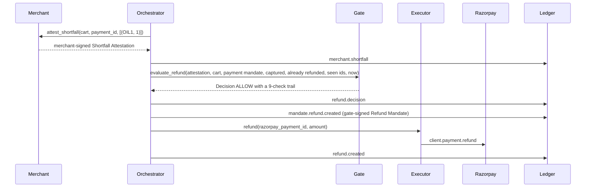

# Architecture

## Components and what each may touch

| Component | May read | Signs with | May call |
|---|---|---|---|
| Buyer agent (`agent.py`) | mandate summary (caps, merchants, categories), the user's request, the catalog as untrusted JSON | agent key (Agent Proposal only) | the LLM endpoint only (`LLMAgent`); nothing (`ScriptedAgent`) |
| Planner agent (a fifth key role, `planner`) | the mandate it holds | planner key (Sub-Mandates only, and only narrower than what it holds) | nothing; it never talks to a merchant or to Razorpay |
| Mock merchant (`merchant.py`) | its own feed (validated at load: five required keys, integer non-negative `price_paise`), the signed proposal, the signed cart it is attesting against | merchant key (Cart Mandate, Shortfall Attestation) | nothing |
| Registry (`registry.py`) | agent id → public key, status | — | nothing |
| Policy gate (`gate.py`) | purchases: the intent, proposal and cart envelopes, the sub-mandate chain, an optional step-up envelope, the user public key, the merchant public keys, prior spend for the root and per sub-mandate, `now`. Refunds: the attestation, cart and payment-mandate envelopes, the merchant and gate public keys, captured and already-refunded amounts, the shortfall ids already seen, `now` | — (pure functions `evaluate` / `evaluate_refund`; both return a `Decision`) | nothing: no I/O, no clock, no LLM, no network |
| Executor (`executor.py`) | a signed Payment Mandate; for a refund, the amount from a gate-signed Refund Mandate | — | Razorpay: the only module that imports `razorpay` and the only holder of the Razorpay credentials |
| Ledger (`ledger.py`) | events; for `replay()`, only its own file | — | the local JSONL file |
| Orchestrator (`orchestrator.py`) | everything above | user key (Intent Mandate, Step-Up Token), planner key (Sub-Mandate), gate key (Payment Mandate and Refund Mandate, only after the matching `Decision.verdict == "ALLOW"`) | wires the others; writes every ledger event |

Trust boundary: the agent module is constructed with the agent key only; the LLM never receives key material. All five Ed25519 keys (user, agent, merchant, gate, planner) are loaded by the one orchestrator process in this demo (a production deployment would load each role's key in its own process). The gate never calls the LLM.

## Sequence (happy path)



A merchant refusal, or a signed cart that fails strict parsing, is recorded as `merchant.quote.rejected` and the run stops with outcome `quote_rejected`; nothing is evaluated. Before the gate runs, the orchestrator checks the ledger for a `payment.captured` event with the same cart id and refuses a replay (`orchestrator.replay_refused`). Prior spend is computed from the ledger and passed into the gate: `Ledger.spent_for(id)` sums the `payment.captured` amounts recorded for that mandate id — as the intent id, or anywhere in a capture's `chain_ids` — minus any `refund.created` amounts against those payments. The orchestrator passes the root's figure as `spent_paise` and one figure per sub-mandate as `spent_by`.

## Delegation (scenario `delegate`)

The intent is issued to the planner instead of the shopper. The planner signs a Sub-Mandate — narrower caps, a subset of the merchants and categories, an expiry no later than its own — for the shopper, which then proposes as usual. The chain travels with the decision, root-first.

```mermaid
sequenceDiagram
    participant U as User
    participant P as Planner agent
    participant A as Shopper agent
    participant G as Gate
    participant L as Ledger
    U->>P: Intent Mandate (2,000 / 1,500, kirana-one, groceries)
    P->>A: Sub-Mandate (1,000 / 1,000, same merchant and category, same expiry)
    P->>L: mandate.sub.created (envelope, sub_id, parent_id, delegator_id, agent_id)
    A->>G: proposal + cart + the chain [sub]
    G->>G: R18 shape of the chain, R19 every link narrows its parent
    G->>G: R06/R12/R13/R17 against the leaf; R14/R15 against every link
    G->>L: gate.decision (chain_ids, spent_by per link)
```

The gate walks the chain twice. Pass one (R18) checks only shape — delegator registered and active, the envelope verifying against that delegator's registry key, `parent_id` pointing at the previous link, the delegator being the previous link's agent, no repeated id, at most `MAX_DELEGATION_LINKS = 8` — and records its verdict before pass two runs, so an R19 denial still leaves an R18 result in the trail. Pass two (R19) checks that each link only narrows its parent. Everything downstream then uses the leaf's bounds, except the caps: R14 and R15 are tested against every link with spend counted per link id, and the failing detail names the root-most link that breached, because R19 makes the caps non-increasing and naming only the leaf would hide that a more senior authority was exceeded too. `payment.captured` carries `chain_ids` (root intent first, then each sub id) so `Ledger.spent_for` can charge one delegated purchase against every mandate it was made under.

## Refund flow (scenario `refund`)

A refund is a money action, so it takes the same route: the merchant states facts, the gate decides, the executor obeys a signed mandate.



The merchant's own `attest_shortfall` refuses an empty claim, an unknown SKU or a `qty_short` outside the cart line, and a refusal is recorded as `merchant.shortfall.rejected`; but the gate re-derives the amount from the signed cart anyway (RF06), so the merchant's number is evidence, not authority. Captured and already-refunded totals come from the ledger (`payment.captured` and `refund.created` for that payment mandate), which is what bounds the refund at RF07 and makes RF08's duplicate check possible. A Razorpay failure is `refund.failed`: the capture stands and nothing is invented.

## Replay

`Ledger.replay() -> ReplayReport` re-decides every `gate.decision` and `refund.decision` in the file, using nothing but the events before it. For each decision it reconstructs:

- the **registry** as of that seq, replayed from `agent.registered` / `agent.revoked` (and, like the live registry, refusing to re-register an id that was revoked);
- the **envelopes** by id: the intent from `mandate.intent.created`, each sub-mandate in `chain_ids[1:]` from `mandate.sub.created` (`chain_ids[0]` is the root intent, not a sub-mandate), the cart from `merchant.cart.quoted`, the proposal from `agent.proposal` found through the cart's own `proposal_id`, the step-up from `stepup.approved`, and for refunds the attestation from `merchant.shortfall` and the payment mandate from `mandate.payment.created`;
- the **public keys** from the events that introduced them: `user_pubkey` on the intent event, `merchant_pubkey` on the cart event, `gate_pubkey` on the refund decision itself;
- the **numbers** the decision recorded: `now`, `spent_paise`, `spent_by`, and for refunds `captured_paise`, `refunded_paise`, `seen_shortfalls`.

It then runs the same pure gate and compares `verdict`, `rule_id`, `reason` and the whole `checks` list. A missing input raises an internal `_Unreplayable`, which becomes a row saying so rather than an exception; any other surprise is caught the same way, because an audit tool that crashes on a hostile file is not an audit tool. `ledger replay` prints one row per decision and exits 2 on the first divergence. The import of `gate`, `crypto` and `registry` inside `replay()` is deliberate: the gate must not know the ledger exists, and a module-level import here would make that circular.

`verify` and `replay` answer different questions. `verify` proves the file has not been edited; `replay` proves the decisions in it are the ones the gate produces from the inputs recorded alongside them. Re-hashing the chain after doctoring a verdict defeats the first and not the second (`tests/test_ledger.py::test_replay_detects_a_doctored_verdict`).

## Why the gate is a pure function

`PolicyGate.evaluate(GateInput) -> Decision` takes every input explicitly: envelopes, public keys, prior spend, the clock. No I/O, no globals, no LLM. That is what makes it testable one rule at a time (`tests/test_gate.py`), replayable from the ledger, and impossible for the model to influence except through the one signed proposal it is allowed to make.

Two guards keep it total. Parsing at the deserialization boundary is strict (`mandates.MalformedMandate`), so a payload with the wrong shape is rule R00, not a `TypeError`. `evaluate` wraps `_evaluate`, so any other exception becomes a DENY on R99 with the exception type in the trail. The gate never raises. Money is integer paise throughout, including the formatter in the check details.

## Where money moves

Two calls move money, and both are downstream of an ALLOW. `RazorpayExecutor.create_payment_link(PaymentMandate, description, notes)` only accepts a `PaymentMandate`, and only the orchestrator constructs one, only after `evaluate` returned ALLOW; the link carries the intent, cart, payment mandate and agent ids in its `notes`, and `reference_id` is the payment mandate id. `RazorpayExecutor.refund(razorpay_payment_id, amount_paise, notes)` is called only with the amount from a gate-signed `RefundMandate`, and only after `evaluate_refund` returned ALLOW; its notes carry the intent, payment mandate and refund mandate ids.

After that the executor polls: `payment_link.fetch` for `status == "paid"` (capture), and, because the link's own `payments` array lists only captured payments, `order.payments(order_id)` for failed attempts once the link carries an `order_id`, with `payment.all` matched on `notes.payment_id` as the fallback before that. A retry re-runs the gate on the same cart before the second attempt. When the run ends without a capture the link is cancelled; if the cancel fails, one last poll looks for a late capture before `razorpay.link.cancel_failed` is recorded.

## Ledger

`runs/<run-id>/ledger.jsonl`, one event per line: `{seq, id, ts, type, actor, payload, prev_hash, hash}` with `hash = sha256(prev_hash + canonical(event without hash))`. Payloads are normalised through JSON before hashing so what is hashed is exactly what a reload produces. `verify()` recomputes every hash and reports the first bad position (a hash mismatch, a `seq` out of place, or a line that does not parse). The chain detects modification, insertion, deletion and reordering; it does not detect tail truncation or a re-hashed last line, so the receipt's head hash is the out-of-band anchor. Tamper-evident, not tamper-proof. The receipt re-verifies the chain it is exported from and prints `- Chain: verified` or `- Chain: BROKEN at seq N` next to the head hash.
